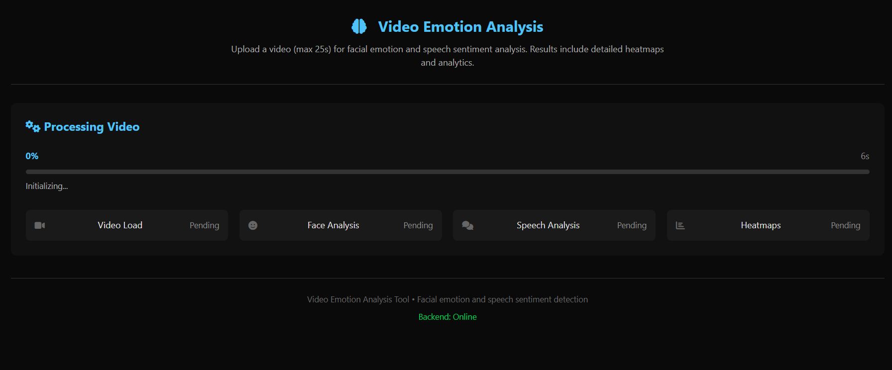
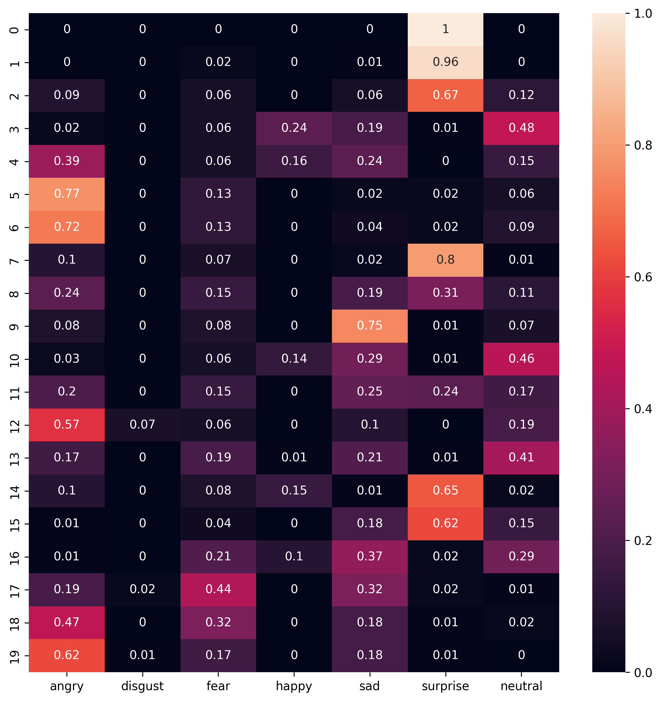

# Short Video Emotion & Sentiment Analyser

A Flask-based web application that analyses short videos for facial emotions and speech sentiment using pre-trained ML models — no database required, fully local.

---

## Screenshots

### Main Interface


### Video Emotions Heatmap


---

## Features

- **Facial Emotion Detection** — frame-by-frame analysis using the [FER](https://github.com/justinshenk/fer) library
- **Speech-to-Text** — converts audio track to text via `SpeechRecognition`
- **Sentiment Analysis** — scores positive / neutral / negative sentiment using VADER (NLTK)
- **Heatmaps** — visualises emotion and sentiment over time
- **Real-time Progress** — SSE (Server-Sent Events) stream for live job updates
- **In-Memory Job Store** — no external database needed

---

## Tech Stack

| Layer | Technology |
|---|---|
| Backend | Python, Flask |
| Emotion Detection | FER, OpenCV, PyTorch |
| Speech Recognition | SpeechRecognition, FFmpeg |
| Sentiment Analysis | NLTK VADER |
| Visualisation | Matplotlib, Seaborn |
| Frontend | HTML, CSS, JavaScript (SSE) |
| Containerisation | Docker, Docker Compose |

---

## How to Run

### Option 1 — Local (Fastest)

```bash
# 1. Create & activate virtual environment
python -m venv venv
.\venv\Scripts\Activate.ps1      # Windows
# source venv/bin/activate        # macOS/Linux

# 2. Install dependencies
pip install -r requirements.txt

# 3. Start the server
python app.py
```

Open **http://localhost:5000** in your browser.

### Option 2 — Docker

```bash
docker compose up --build
```

Open **http://localhost:5000** in your browser.

> Note: First Docker build is slow (~15–30 min) due to TensorFlow and PyTorch download. Subsequent builds are fast due to layer caching.

---

## Project Structure

```
.
├── app.py                  # Flask application & analysis logic
├── video_analytics.py      # Core video processing utilities
├── requirements.txt        # Python dependencies
├── Dockerfile
├── docker-compose.yml
├── static/                 # Frontend assets (JS, CSS)
├── templates/              # HTML templates
├── uploads/                # Temporary uploaded files
└── Images/                 # Screenshots & sample outputs
```

---

## Notes

- Recommended video length: 20–40 seconds (longer videos take more time)
- Supported formats: `mp4`, `avi`, `mov`, `mkv`
- FFmpeg must be installed locally (included automatically in Docker)
